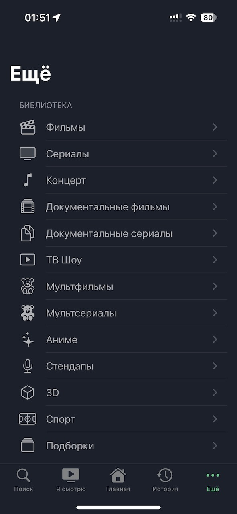
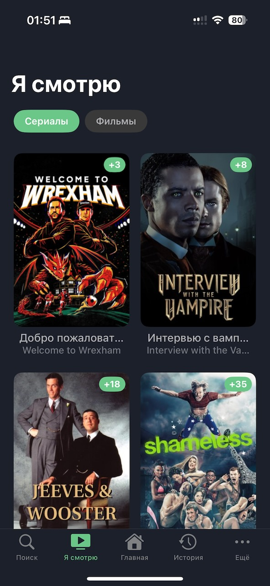
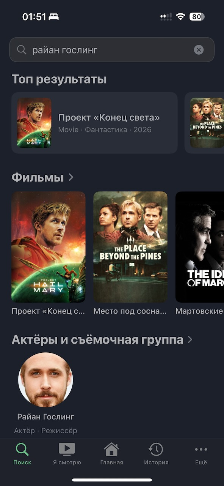
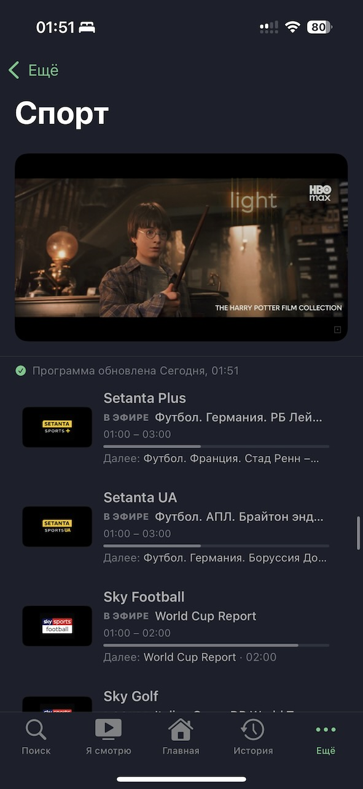
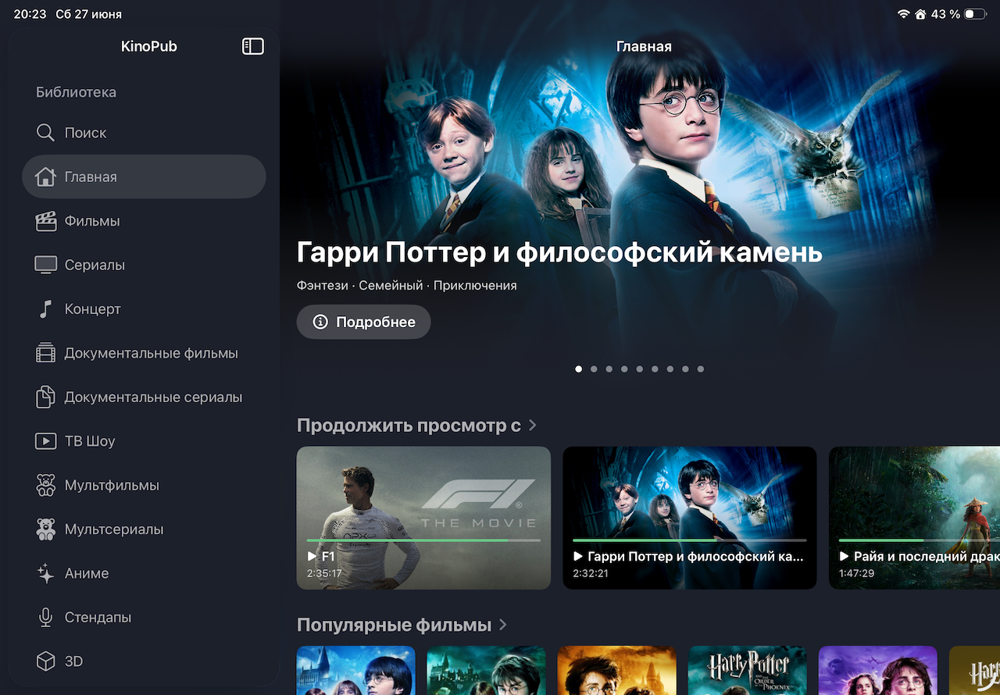
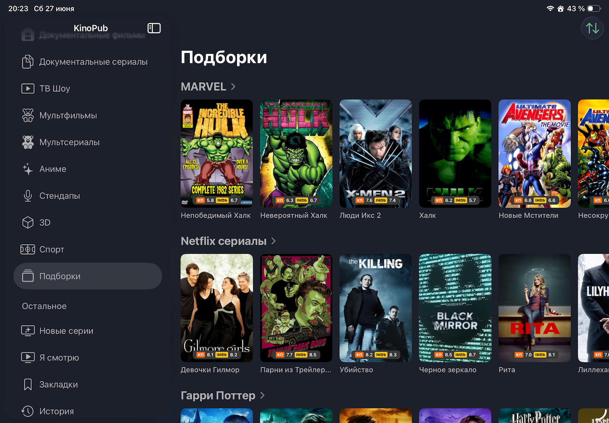
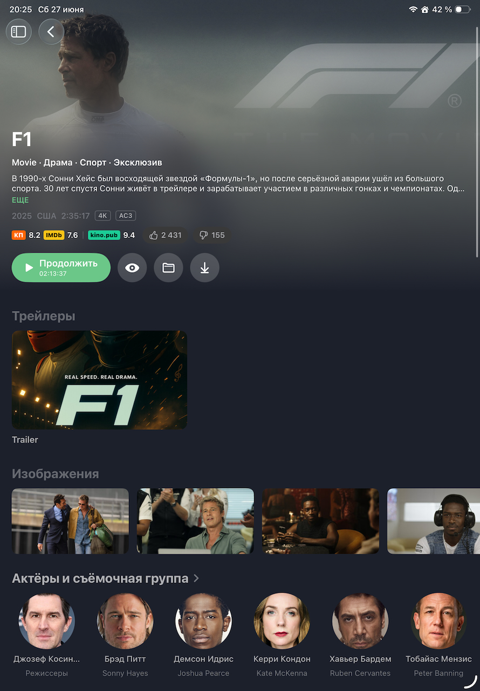
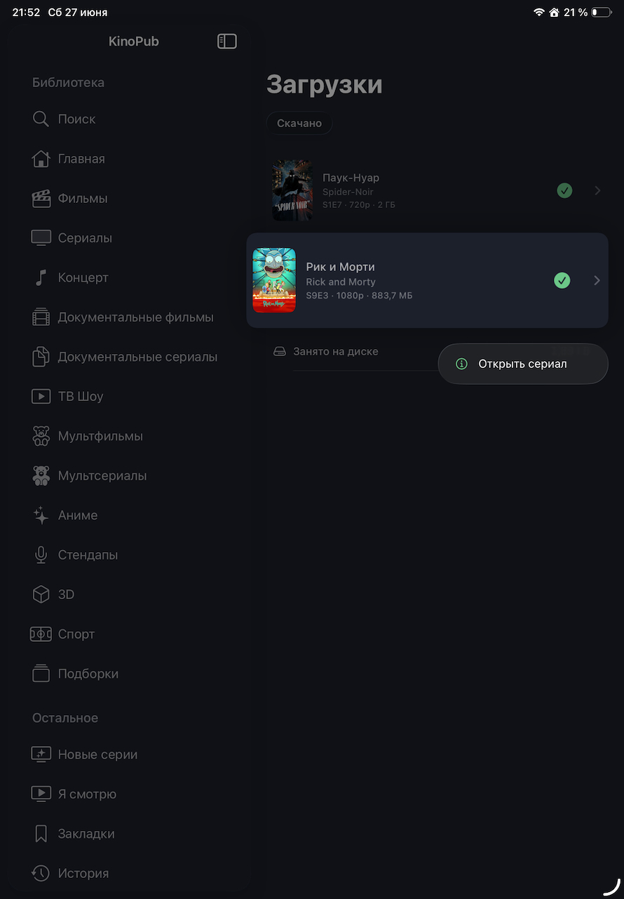

<div align="center">

# KinoPub — Apple Client

Native **iOS · iPadOS · macOS** client for the [kino.pub](https://kino.pub) service, built with SwiftUI.

[](https://github.com/dungeon-master-xx/kinopub-apple-client/actions/workflows/ci.yml)
[](https://github.com/dungeon-master-xx/kinopub-apple-client/releases/latest)
[](https://github.com/dungeon-master-xx/kinopub-apple-client/releases)
[](#auto-updating-source-altstore--sidestore--feather)
[](#requirements)
[](https://github.com/dungeon-master-xx/kinopub-apple-client/commits/main)

🌐 **[Website](https://dungeon-master-xx.github.io/kinopub-apple-client/)** · 📥 **[Install](https://github.com/dungeon-master-xx/kinopub-apple-client/wiki/Установка)** · 📖 **[Wiki / FAQ](https://github.com/dungeon-master-xx/kinopub-apple-client/wiki)** · 🏷 **[Releases](https://github.com/dungeon-master-xx/kinopub-apple-client/releases)**

</div>

---

> ℹ️ **Community fork.** This is an actively-maintained fork of
> [leoru/kinopub-apple-client](https://github.com/leoru/kinopub-apple-client) with many additional
> features and cross-platform fixes. All credit for the original project goes to the upstream authors.

## Features

- 🎬 Catalog of movies & series, collections, bookmarks, watch history, "continue watching"
- 🔎 Search by title **and** by cast / crew (full person pages)
- ⬇️ Offline downloads (iOS HLS `.movpkg`, macOS/fallback mp4)
- 📺 4K / HEVC / **HDR10** on capable devices
- 🏟 Sport channels with multi-source EPG
- 🖥 Native macOS UI & full-screen player
- 🌍 16 UI languages

## Screenshots

### iPhone

<table>
  <tr>
    <td></td>
    <td></td>
    <td></td>
    <td></td>
  </tr>
  <tr>
    <td></td>
    <td></td>
    <td></td>
    <td></td>
  </tr>
</table>

### iPad

<table>
  <tr>
    <td></td>
    <td></td>
  </tr>
  <tr>
    <td></td>
    <td></td>
  </tr>
  <tr>
    <td></td>
    <td></td>
  </tr>
</table>

## Install

The app is distributed as an **unsigned IPA** in [Releases](https://github.com/dungeon-master-xx/kinopub-apple-client/releases/latest)
(it's not on the App Store). Install it with AltStore, SideStore, Sideloadly, TrollStore, or sign it
yourself — full step-by-step guide in the **[Wiki](https://github.com/dungeon-master-xx/kinopub-apple-client/wiki/Установка)**.

### Auto-updating source (AltStore · SideStore · Feather)

Add this repo as a source to install in one tap and **get new versions automatically**.

<div align="center">

[](https://github.com/dungeon-master-xx/kinopub-apple-client/releases/latest)

[](https://dungeon-master-xx.github.io/kinopub-apple-client/?r=altstore-classic://source?url=https%3A%2F%2Fgithub.com%2Fdungeon-master-xx%2Fkinopub-apple-client%2Freleases%2Flatest%2Fdownload%2Fapps.json)
&nbsp;
[](https://dungeon-master-xx.github.io/kinopub-apple-client/?r=sidestore://source?url=https%3A%2F%2Fgithub.com%2Fdungeon-master-xx%2Fkinopub-apple-client%2Freleases%2Flatest%2Fdownload%2Fapps.json)

</div>

> Tap the buttons **on your iPhone/iPad**, or add the source URL manually → Browse → Sources → ➕:
> ```
> https://github.com/dungeon-master-xx/kinopub-apple-client/releases/latest/download/apps.json
> ```
>
> ⚠️ Use **AltStore Classic** or **SideStore** (free sideloading with your own Apple ID). The EU
> **AltStore PAL** marketplace only installs Apple-notarized apps and won't load this source.

You'll need an active kino.pub subscription; sign in with the on-screen device code.

## Requirements

- iOS / iPadOS **16+**, macOS **13+**
- To build: **Xcode 16+** (Xcode 26 for the iOS 26 Liquid Glass icon & effects)

## Building

```bash
git clone https://github.com/dungeon-master-xx/kinopub-apple-client.git
cd kinopub-apple-client
open KinoPubAppleClient.xcodeproj
```

In **Signing & Capabilities** pick your team (the repo ships an empty `DEVELOPMENT_TEAM` — don't commit
yours), then build & run. To produce an unsigned IPA locally: `./scripts/build-ipa.sh`.

## Project structure

Swift Package Manager workspace:

| Package | Purpose |
|---|---|
| `KinoPubAppleClient` | Main app target, shared across platforms |
| `KinoPubUI` | Reusable SwiftUI components |
| `KinoPubKit` | Shared business logic |
| `KinoPubBackend` | Networking layer (kino.pub API) |
| `KinoPubLogging` | OSLog helpers |

Third-party: [PopupView](https://github.com/exyte/PopupView), [KeychainAccess](https://github.com/kishikawakatsumi/KeychainAccess),
[SkeletonUI](https://github.com/CSolanaM/SkeletonUI), [Reachability](https://github.com/ashleymills/Reachability.swift).

## Contributing

Issues and PRs welcome — see [CONTRIBUTING.md](CONTRIBUTING.md). We use Conventional Commits; releases
are automated via Release Please. Please follow the [Code of Conduct](CODE_OF_CONDUCT.md).

## License

The upstream project ships **no license**, so this fork does not relicense it. All rights remain with
the original authors; this fork is provided for personal/educational use. See [SECURITY.md](SECURITY.md)
for vulnerability reporting.
